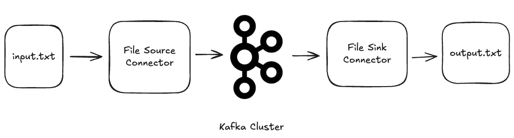

# Stream messages using File Connector Plugin



## Pre-setup
`Apache Kafka` package provides prebuilt `File Source Connector` and `File Sink Connector` out of the box for quick testing of Kafka Connect features. But the `confluentinc/cp-server-connect` image does not provide these two by default. So we can download and copy over from `Apache Kafka` package.

In `cp-server-connect` container, download `Apache Kafka`:
```
curl -O https://downloads.apache.org/kafka/4.0.1/kafka_2.13-4.0.1.tgz
```

Unzip it
```
tar -xzf kafka_2.13-4.0.1.tgz
```

The File Connector Plugin is `connect-file-*.jar` file, which we need to copy it over `CONNECT_PLUGIN_PATH` located at `/usr/share/java`. Usually this is directory where we store all connector plugins.
```
cp kafka_2.13-4.0.1/libs/connect-file-4.0.1.jar /usr/share/java/kafka-connect-file/
```

Now that we have both `File Source Connector` and `File Sink Connector` plugin installed. Verify by running:
```
curl -sS -X GET localhost:8083/connector-plugins | jq
```

## Config and Stream sample messages

Next, write JSON config for these two source and sink connector. Refer to `cp-all-in-one/connectors_config/file_source.json` and `cp-all-in-one/connectors_config/file_sink.json`.

Start File Source Connector:
```
curl -i -X POST -H "Accept:application/json" -H  "Content-Type:application/json" http://localhost:8083/connectors/ --data-binary @./cp-all-in-one/connectors_config/file_source.json
```

Start File Sink Connector:
```
curl -i -X POST -H "Accept:application/json" -H  "Content-Type:application/json" http://localhost:8083/connectors/ --data-binary @./cp-all-in-one/connectors_config/file_sink.json
```

Now that two File Connectors are running. Verify by running:
```
curl -X GET http://localhost:8083/connectors/file_source/status | jq
curl -X GET http://localhost:8083/connectors/file_sink/status | jq
```

Start writing some messages to `input.txt`. We will see they get published to specified Kafka Topic called `file-demo`, which `output.txt` file will eventually consume those input messages from input file.

Check output file:
```
tail -F output.txt
```
